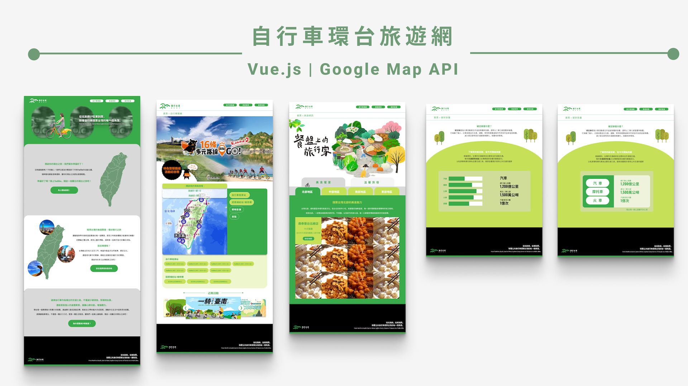

# 自行車環台旅遊網 🚴



此專案為自行車環台旅遊網站，主要功能包括搜尋鄰近 UBike 站點、查詢自行車路線（環島一號線）、各地美食推薦及碳排放量宣導，旨在推廣綠色交通和低碳旅遊概念。此專案以 Vue.js 和 SCSS 為核心技術，並串接 Google Map API，專注於掌握前端技術的應用。

## 功能介紹

- **UBike 站點搜尋**：根據使用者當前位置或指定地點搜尋附近的 UBike 租借站。
- **自行車路線查詢**：顯示環島一號線推薦自行車路線，並提供詳細的地圖標示和路線資訊。
- **各地美食推薦**：依照台灣北、中、南、東地區推薦特色小吃與餐廳，讓騎行者可在旅途中享受在地美食。
- **碳排放量宣導**：提供騎行碳排放減少量的資訊，鼓勵使用者選擇環保的交通方式。

## 使用技術

- **前端框架**：Vue.js
- **樣式**：SCSS
- **地圖 API**：Google Map API

## 安裝與使用

1. 下載專案：
   ```bash
   git clone https://github.com/jainexx/cycling-taiwan-tour.git
   cd cycling-taiwan-tour
   ```

2. 安裝相依套件：
   ```bash
   npm install
   ```

3. 啟動開發伺服器：
   ```bash
   npm run dev
   ```

## 未來優化方向

- 增加更多推薦路線和景點資料
- 整合可攜帶自行車的火車路線，推廣綠色鐵道旅行，促進沿線觀光和生態旅遊。

## 聯絡方式
若對專案有任何問題或建議，歡迎聯絡我：

-   Email: jainesbox@email.com
-   GitHub: [jainexx](https://github.com/jainexx)

---
© 2024 自行車環台旅遊網. All Rights Reserved.
